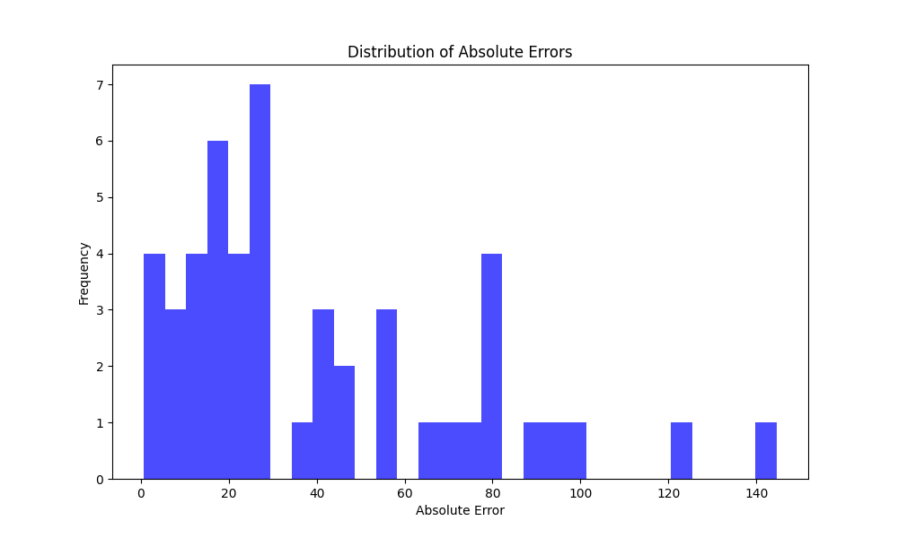

# Бизнес-применение машинного обучения
## Домашнее задание №1

## Описание работы

### Шаг 1: Бесконечная отправка вектора признаков и ответов
В файле `features.py` реализуется бесконечная отправка данных с уникальными идентификаторами. Для этого:
1. Используется модуль `time` для задания задержки между итерациями (`time.sleep`).
2. Генерируются уникальные идентификаторы сообщений с помощью модуля `datetime`:
   ```python
   from datetime import datetime
   message_id = datetime.timestamp(datetime.now())
   ```
3. Сообщения передаются в формате словарей, включая идентификатор:
   ```python
   message_y_true = {
       'id': message_id,
       'body': y[random_row]
   }
   ```
4. Уникальный идентификатор связывает признаки, истинные ответы и предсказания.

### Шаг 2: Логирование метрик
Для записи метрик создаётся файл `./logs/metric_log.csv` со следующими столбцами:
- `id`: уникальный идентификатор.
- `y_true`: истинные метки.
- `y_pred`: предсказания.
- `absolute_error`: абсолютные ошибки.

Скрипт `metric.py` модифицируется для:
1. Записи метрик в реальном времени.
2. Вычисления абсолютных ошибок по формуле:
   \[
   \text{absolute\_error} = |y\_true - y\_pred|
   \]
3. Организации обработки асинхронных сообщений:
   - Сообщения сохраняются во временную структуру данных (например, `DataFrame`).
   - Расчёт ошибки производится при наличии обоих значений (`y_true` и `y_pred`) для одного `id`.

Пример содержимого `metric_log.csv`:
```csv
id,y_true,y_pred,absolute_error
1669147134.196809,295.0,221.77392889122234,73.22607110877766
1669147136.824343,153.0,118.44344405446542,34.55655594553458
1669147141.035324,189.0,204.06083656673704,15.060836566737038
1669147148.42061,173.0,200.44085356158348,27.44085356158348
1669147162.280003,154.0,159.34185386962795,5.341853869627954
```

### Шаг 3: Построение графика распределения ошибок
Создаётся новый сервис `plot`, выполняющий:
1. Чтение файла `metric_log.csv` в бесконечном цикле.
2. Построение гистограммы абсолютных ошибок.
3. Сохранение графика в файл `./logs/error_distribution.png`.

Пример кода построения графика:
```python
import pandas as pd
import matplotlib.pyplot as plt

# Чтение метрик
data = pd.read_csv('./logs/metric_log.csv')

# Построение гистограммы
plt.figure(figsize=(10, 6))
plt.hist(data['absolute_error'], bins=20, color='blue', edgecolor='black')
plt.title('Распределение абсолютных ошибок')
plt.xlabel('Абсолютная ошибка')
plt.ylabel('Частота')
plt.savefig('./logs/error_distribution.png')
plt.close()
```

### Docker и Compose
1. Для сервиса `plot` создаётся `Dockerfile` с установкой всех зависимостей.
2. Зависимости указываются в `requirements.txt`, включая `pandas` и `matplotlib`.
3. В `docker-compose.yml` добавляется сервис `plot` с монтированием директории `logs`:
   ```yaml
   services:
     plot:
       build:
         context: .
         dockerfile: Dockerfile
       volumes:
         - ./logs:/app/logs
       depends_on:
         - metric
   ```

### Результат
- **Файл `metric_log.csv`** обновляется с каждой итерацией сервиса `features`.
- **Файл `error_distribution.png`** содержит гистограмму абсолютных ошибок, обновляемую после каждой итерации.

Пример гистограммы:


